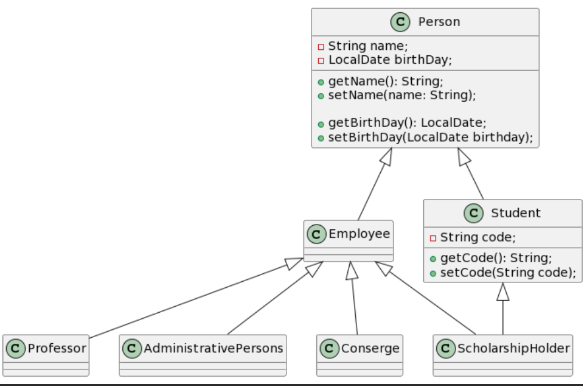
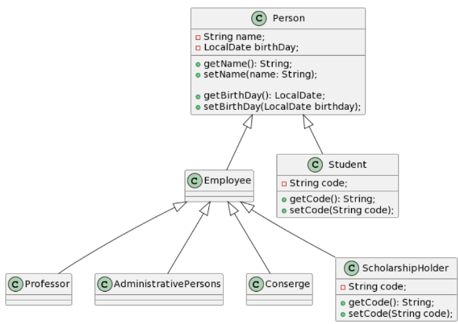

La Herencia Multiple es el concepto de que una clase herede de varias clase padre. 
En el diagrama se ve en ScholarshipHolder donde tiene tanto los atributos y metodos de un empleado como los de un estudiante. 

El problema con esto es que nos genera una duplicidad de informacion de la clase padre Person. A quien se le elige que, a
Employee que nos de el nombre y cumpleaños o a Student

Es por esto que Java no permite la Herencia Multiple

El diagrama del ejercicio quedaria asi:
